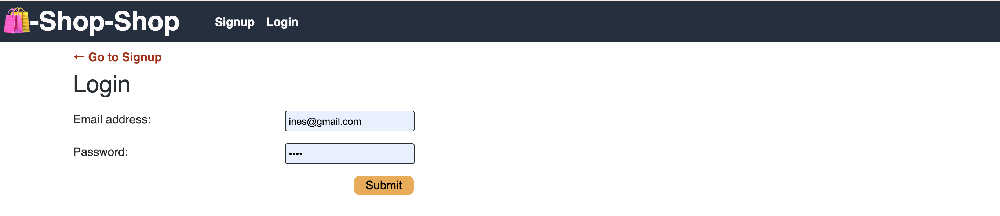
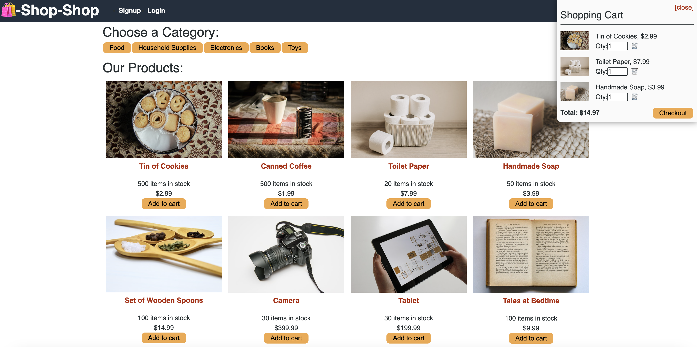
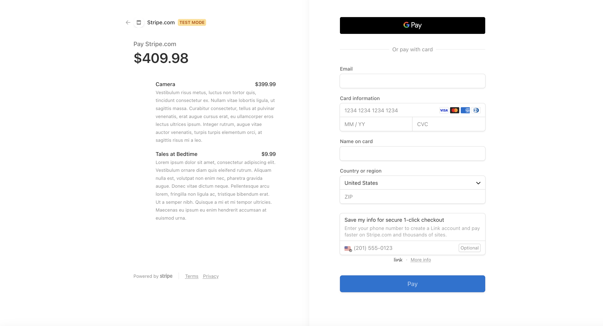

# shop-shop-center


## Table of Contents
* [Description](#description)
* [Assets](#assets)
* [Assets](#assets)
* [Installation](#installation)
* [Usage](#usage)
* [Contributing](#contributing)
* [Questions](#questions)

## Description
Shop-shop-center is a platform used Redux to manage global state instead of the Context API, and website's state management is taken out of the React ecosystem

- Deployed link: https://github.com/kaihuan-huang/shop-shop-center


## More details
```
AS a senior engineer working on an e-commerce platform
I WANT my platform to use Redux to manage global state instead of the Context API
SO THAT my website's state management is taken out of the React ecosystem

GIVEN an e-commerce platform that uses Redux to manage global state
WHEN I review the app’s store
THEN I find that the app uses a Redux store instead of the Context API
WHEN I review the way the React front end accesses the store
THEN I find that the app uses a Redux provider
WHEN I review the way the app determines changes to its global state
THEN I find that the app passes reducers to a Redux store instead of using the Context API
WHEN I review the way the app extracts state data from the store
THEN I find that the app uses Redux instead of the Context API
WHEN I review the way the app dispatches actions
THEN I find that the app uses Redux instead of the Context API
```
## Assets

The following images demonstrate the web application's appearance and functionality in Insomnia:






## Installation 
The user should clone the repository from GitHub and download Node. 
Run `npm install ` to install.
Run `npm run seed ` to run the database.
Run `npm run develop ` to start the Shop-shop-center.


## Contributing 
Contributors should read the installation section. 

## Technologies used

```
  R​​edux
  React
  tested in Insomnia
  MongoDB database
```
## Questions
If you have any questions about this projects, please contact me directly at huangkaihuan0216@gmail.com. You can view more of my projects at https://github.com/kaihuan-huang.

## Made by 
```
Kaihuan Huang

```